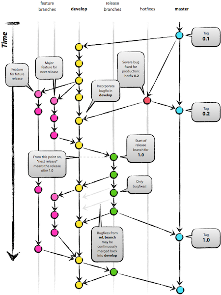

!SLIDE

# Use Git

<!SLIDE small>

While this class isn't about git, you should use it early and often.

    git init
    git add (files)
    git commit -m "<Descriptive message about change>"

Optionally
   
    git remote add origin <some git repo (github!)>
    git push origin master

<!SLIDE center>

[Git Flow](http://nvie.com/posts/a-successful-git-branching-model/)

