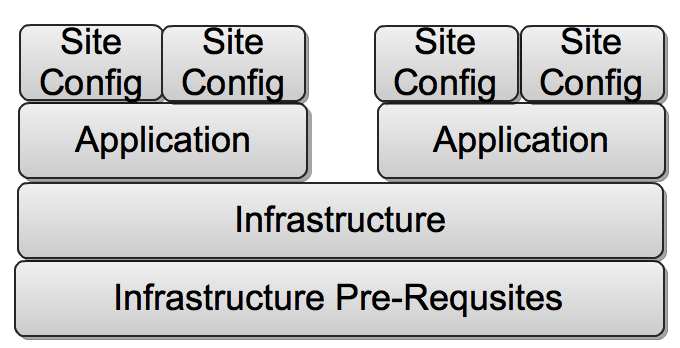

!SLIDE

What is the right way to organize modules that work together?

!SLIDE

!SLIDE

# Distribution Modules

+ Code that is generic to install a shared component should belong iin
the `dist` directory. 
+ Manifests in this directory can cross-reference other Manifests in the
distribution directory, but they cannot depend on site manifests. 
These Manifests should be edited as infrequently as possible

!SLIDE

# Site Modules

+ Code that is site-specific to an organization should belong in the
`site` directory. 
+ Manifests in this directory can depend on `dist` Manifests or other site’
manifests. 

<!SLIDE smaller>

# When to use Custom Definitions vs Type/Provider

+ Familiarility with Ruby (Pre-Req!)
+ When you need to have the configuration modeled in the catalog
  - Useful for exporting resources
+ Creating complex resource relationships.
  - Definitions are purposely limited
+ When you need more complex control of the interaction with the OS
  - Custom Definitions 

